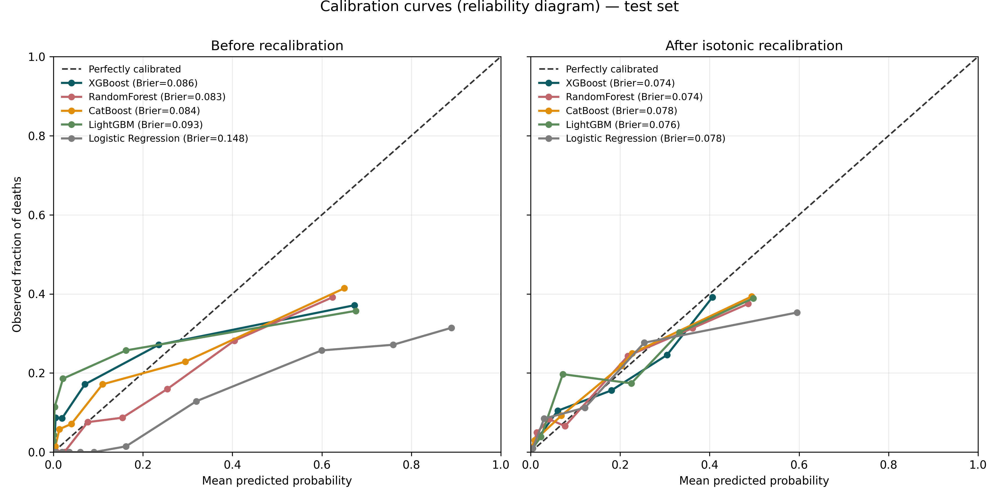
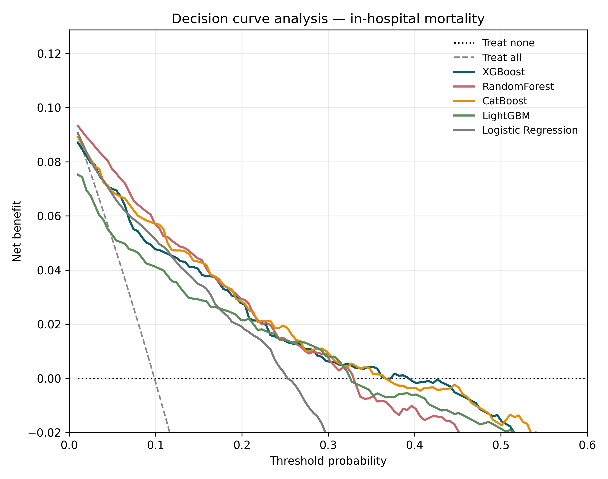
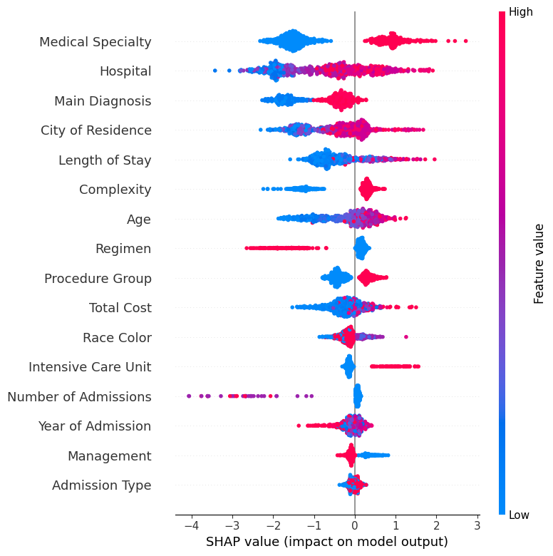
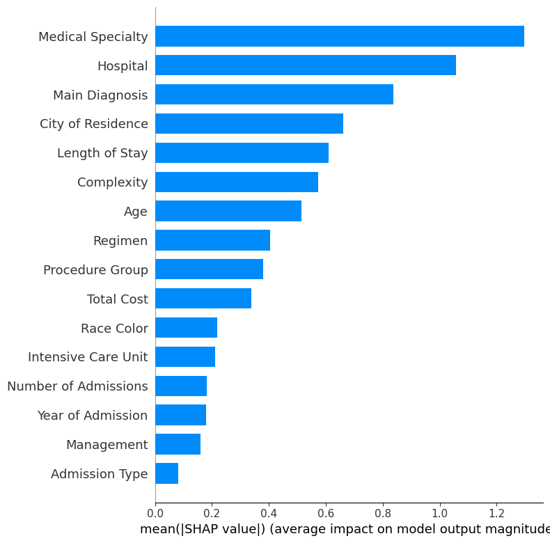

<h1 align="center">Machine Learning for Hospital-Level Risk Stratification of<br>In-Hospital Mortality in Cervical Cancer</h1>

<p align="center">
  <em>A population-based study using SUS administrative hospitalization data — Mato Grosso, Brazil (2011–2023)</em>
</p>

<p align="center">
  
  
  
  
  
  
</p>

---

## Overview

Cervical cancer remains a leading cause of cancer death among women in low- and middle-income countries. Using **routinely collected hospital admission records** from the Brazilian Unified Health System (SIH/SUS), we trained and interpreted machine-learning models to estimate the risk of **in-hospital mortality** and to identify the clinical and system-level factors most associated with it.

Five algorithms — **XGBoost, Random Forest, CatBoost, LightGBM and Logistic Regression** — are compared under a common protocol and the best model is explained with **SHAP**. Evaluation covers **discrimination**, **calibration** (with post-hoc recalibration), and **clinical utility** (decision curve analysis).

```
Admission records ─► Encoding ─► Stratified split + SMOTE ─► 5-fold tuned models
                                                                    │
                    Discrimination · Calibration (+recalibration) · Net benefit · SHAP
```

> **Analytic sample:** n = **3,493** hospitalizations (**345** in-hospital deaths, 9.9%), obtained from the source records by excluding cases with unknown race. All results and the reproducible script use this sample.

---

## Key results

| Model | AUC-ROC (95% CI) | Accuracy | Sensitivity | Specificity | Brier (95% CI) |
|:------|:----------------:|:--------:|:-----------:|:-----------:|:--------------:|
| **XGBoost** | **0.89 (0.86–0.91)** | 0.88 | 0.31 | 0.95 | **0.08 (0.07–0.10)** |
| Random Forest | 0.88 (0.85–0.90) | 0.88 | 0.32 | 0.94 | 0.08 (0.07–0.10) |
| CatBoost | 0.88 (0.85–0.90) | 0.88 | 0.33 | 0.94 | 0.09 (0.08–0.11) |
| LightGBM | 0.87 (0.84–0.90) | 0.87 | 0.22 | 0.94 | 0.09 (0.08–0.11) |
| Logistic Regression | 0.88 (0.85–0.91) | 0.79 | 0.82 | 0.78 | 0.14 (0.12–0.15) |

<sub>Threshold-dependent metrics at the conventional 0.5 cut-off. Full metrics across thresholds 0.10–0.90 in [`results/TableS1_multithreshold.csv`](results/TableS1_multithreshold.csv); AUROC & Brier with 95% CIs in [`results/discrimination_calibration.csv`](results/discrimination_calibration.csv).</sub>

---

## Model evaluation gallery

### Calibration — before vs. after isotonic recalibration
Before recalibration, the tree-based models track the diagonal reasonably well while Logistic Regression over-estimates risk. After **post-hoc isotonic recalibration** (fitted on a held-out calibration subset at the real class prevalence), **all five models are well calibrated**, with Brier scores converging to ≈ 0.07–0.08 ([`results/brier_recalibrated.csv`](results/brier_recalibrated.csv)).

<p align="center"></p>

### Clinical utility — decision curve analysis
Across the clinically relevant range of threshold probabilities (~0.02–0.40), **every ML model yields a higher net benefit than the "treat-all" and "treat-none" defaults**, supporting model-guided risk stratification and resource allocation.

<p align="center"></p>

### Discrimination — ROC curves
<p align="center"></p>

### Interpretability — SHAP
Medical procedure type, hospitalization cost and service complexity were the most influential predictors of in-hospital mortality.
<p align="center">
  
  
</p>

---

## Repository structure

```
├── README.md
├── Prediçao_Mort_Cancer_Mato_Groso.ipynb   End-to-end analysis notebook
├── reviewer5_additional_analyses.py         Reproducible script (calibration, recalibration, DCA, Table S1)
├── data/
│   └── Banco_Internacao.csv                 De-identified hospitalization dataset (SIH/SUS)
├── figures/                                 300 dpi figures
│   ├── calibration_curves_300dpi.png        Reliability diagram (before/after recalibration)
│   ├── decision_curve_analysis_300dpi.png   Net benefit vs threshold probability
│   ├── all_roc_auc_models_300dpi.png        ROC curves
│   ├── roc_auc_*_300dpi.png                 Per-model ROC
│   ├── bar-shap_*.png · bsw-shape_*.png     SHAP importance / beeswarm
│   └── heatmap_*_300dpi.png                 Correlation heatmaps
└── results/
    ├── discrimination_calibration.csv       AUROC & Brier with 95% CIs
    ├── brier_recalibrated.csv               Brier after isotonic recalibration
    ├── TableS1_multithreshold.csv           Metrics across thresholds 0.10–0.90
    ├── dca_net_benefit_summary.csv          Net benefit at representative thresholds
    └── summary_*.csv                         Threshold-0.5 summaries
```

---

## Reproducing the analyses

```bash
# Python 3.9+  (isolated environment recommended)
pip install scikit-learn category_encoders imbalanced-learn xgboost lightgbm catboost matplotlib pandas numpy

python reviewer5_additional_analyses.py data/Banco_Internacao.csv
# → writes calibration curves (before/after recalibration), decision curve analysis,
#   TableS1_multithreshold, discrimination_calibration and brier_recalibrated to ./outputs
```

The script mirrors the notebook: identical feature encoding, stratified 80/20 split (`random_state=42`), SMOTE on the training fold, and `GridSearchCV` over the same hyper-parameter grids. It restricts to the analytic sample (n = 3,493) by excluding records with unknown race, and adds post-hoc **isotonic recalibration** fitted on a held-out calibration subset.

---

## Methods at a glance

- **Outcome:** in-hospital death (binary) · **Unit:** hospitalization episode
- **Class balance:** ~9.9% mortality; SMOTE on the training set only
- **Validation:** stratified 80/20 hold-out; 5-fold CV for tuning (scoring = ROC-AUC)
- **Calibration:** Brier score + reliability diagrams, with post-hoc isotonic recalibration
- **Clinical utility:** decision curve analysis (net benefit)
- **Reporting:** aligned with the **TRIPOD** guidance for prediction models

---

## Citation

> Victor A, Barcellos Filho F, Xavier Pedro S, Cândido da Silva AM, *et al.*
> *Machine learning for hospital-level risk stratification of in-hospital mortality in cervical cancer hospitalizations: a population-based study in Brazil.* BMC Cancer (under review).

<sub>Data are publicly available through the Mato Grosso State Health Department. Ethical approval was waived (anonymized, publicly accessible administrative data).</sub>
