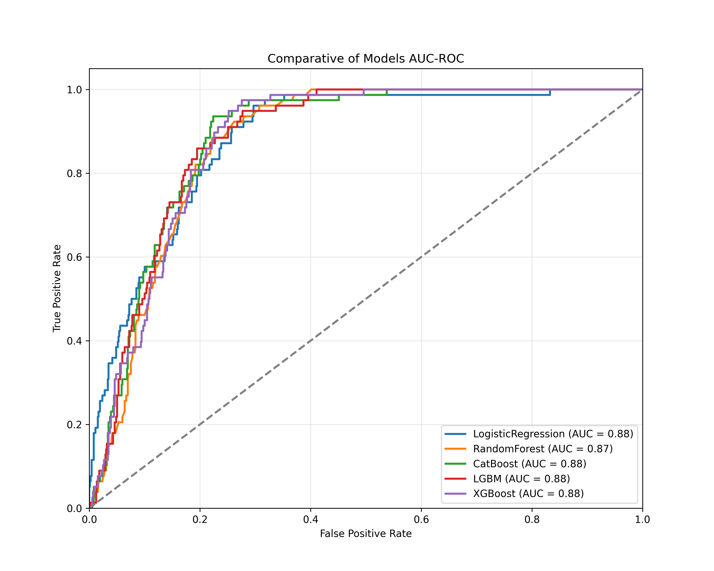
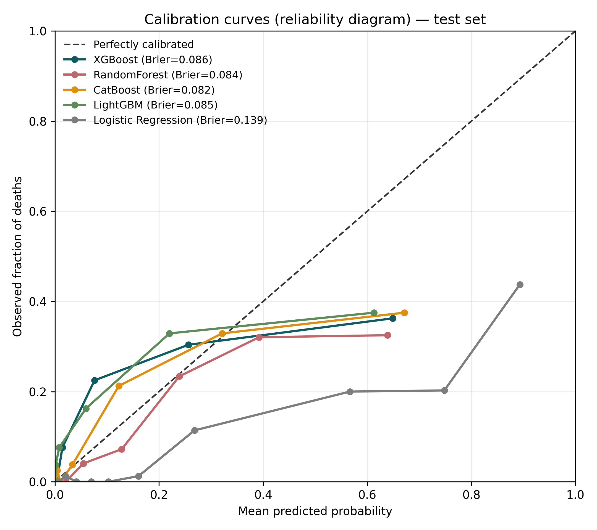
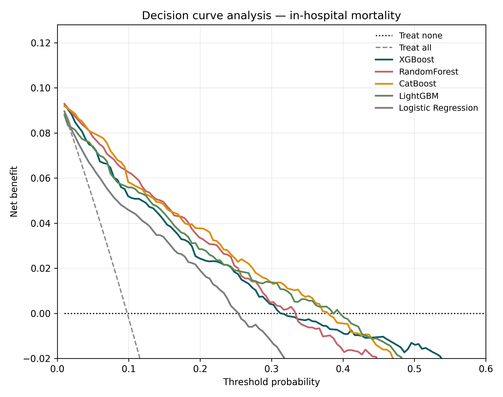

<h1 align="center">Machine Learning for Hospital-Level Risk Stratification of<br>In-Hospital Mortality in Cervical Cancer</h1>

<p align="center">
  <em>A population-based study using SUS administrative hospitalization data — Mato Grosso, Brazil (2011–2023)</em>
</p>

<p align="center">
  
  
  
  
  
</p>

---

## Overview

Cervical cancer remains a leading cause of cancer death among women in low- and middle-income countries. Using **routinely collected hospital admission records** from the Brazilian Unified Health System (SIH/SUS), we trained and interpreted machine-learning models to estimate the risk of **in-hospital mortality** and to identify the clinical and system-level factors most associated with it.

The pipeline compares **five algorithms** — XGBoost, Random Forest, CatBoost, LightGBM and Logistic Regression — under a common protocol (stratified 80/20 split, SMOTE-balanced training, 5-fold cross-validated hyper-parameter search) and explains the best model with **SHAP**.

```
Admission records  →  Encoding  →  Stratified split + SMOTE  →  5-fold tuned models
                                                                      │
                            Discrimination · Calibration · Net benefit · SHAP
```

---

## Key results

| Model | AUC-ROC | Accuracy* | Sensitivity* | Specificity* | Brier (95% CI) |
|:------|:-------:|:---------:|:------------:|:------------:|:--------------:|
| **XGBoost** | **0.88** | 0.89 | 0.32 | 0.95 | **0.086** (0.072–0.102) |
| Random Forest | 0.87 | 0.87 | 0.32 | 0.93 | 0.084 (0.072–0.096) |
| CatBoost | 0.89 | 0.88 | 0.29 | 0.94 | 0.082 (0.069–0.096) |
| LightGBM | 0.88 | 0.88 | 0.21 | 0.95 | 0.085 (0.071–0.101) |
| Logistic Regression | 0.88 | 0.78 | 0.82 | 0.78 | 0.139 (0.122–0.156) |

<sub>*Threshold-dependent metrics reported at the conventional 0.5 cut-off. Full metrics across thresholds 0.10–0.90 are in [`TableS1_multithreshold.csv`](TableS1_multithreshold.csv).</sub>

The tree-based models combined **strong discrimination** with **good calibration** (low Brier scores), while Logistic Regression traded specificity for sensitivity and was noticeably less well calibrated.

---

## Model evaluation gallery

### Discrimination — ROC curves
<p align="center"></p>

### Calibration — reliability diagram
The four tree-based models track the perfect-calibration diagonal closely across the probability range where most patients lie; Logistic Regression falls well below it, over-estimating risk.
<p align="center"></p>

### Clinical utility — decision curve analysis
Across the clinically relevant range of threshold probabilities (~0.02–0.40), **every ML model yields a higher net benefit than the "treat-all" and "treat-none" defaults**, supporting model-guided risk stratification and resource allocation.
<p align="center"></p>

### Interpretability — SHAP
Medical procedure type, hospitalization cost and service complexity were the most influential predictors of in-hospital mortality.
<p align="center">
  
  
</p>

---

## Repository structure

| File | Description |
|:-----|:------------|
| [`Prediçao_Mort_Cancer_Mato_Groso.ipynb`](Prediçao_Mort_Cancer_Mato_Groso.ipynb) | End-to-end analysis notebook (preprocessing → tuning → evaluation → SHAP → **calibration, Table S1, DCA**) |
| [`reviewer5_additional_analyses.py`](reviewer5_additional_analyses.py) | Stand-alone, reproducible script for the calibration curves, multi-threshold table and decision curve analysis |
| `Banco_Internacao.csv` | De-identified hospitalization dataset (SIH/SUS) |
| `calibration_curves_300dpi.png` · `decision_curve_analysis_300dpi.png` | New figures (Reviewer 5) |
| `TableS1_multithreshold.csv` · `brier_scores.csv` · `dca_net_benefit_summary.csv` | New result tables |
| `roc_auc_*_300dpi.png` · `heatmap_*_300dpi.png` · `bar-shap_*` · `bsw-shape_*` | Discrimination, correlation and SHAP figures |

---

## Reproducing the added analyses

```bash
# Python 3.9+  (isolated environment recommended)
pip install scikit-learn category_encoders imbalanced-learn xgboost lightgbm catboost matplotlib pandas numpy

python reviewer5_additional_analyses.py Banco_Internacao.csv
# → writes calibration_curves, decision_curve_analysis, TableS1_multithreshold, brier_scores to ./outputs
```

The script mirrors the notebook exactly: identical feature encoding, stratified split (`random_state=42`), SMOTE on the training fold, and `GridSearchCV` over the same hyper-parameter grids.

---

## Methods at a glance

- **Outcome:** in-hospital death (binary).
- **Unit of analysis:** hospitalization episode.
- **Class balance:** ~9.9% mortality; addressed with SMOTE on the training set only.
- **Validation:** stratified 80/20 hold-out; 5-fold cross-validation for tuning (scoring = ROC-AUC).
- **Reporting:** aligned with the **TRIPOD** guidance for prediction models.

---

## Citation

> Victor A, Barcellos Filho F, Xavier Pedro S, Cândido da Silva AM, *et al.*
> *Machine learning for hospital-level risk stratification of in-hospital mortality in cervical cancer hospitalizations: a population-based study in Brazil.* BMC Cancer (under review).

<sub>Data are publicly available through the Mato Grosso State Health Department. Ethical approval was waived (anonymized, publicly accessible administrative data).</sub>
